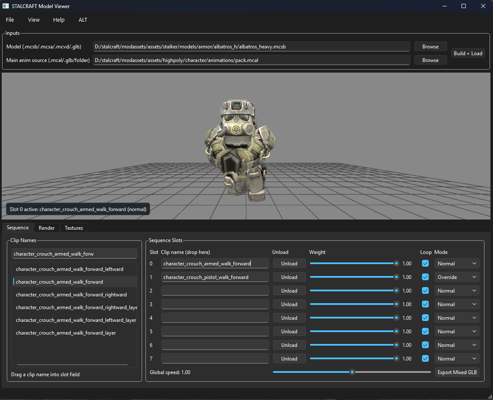
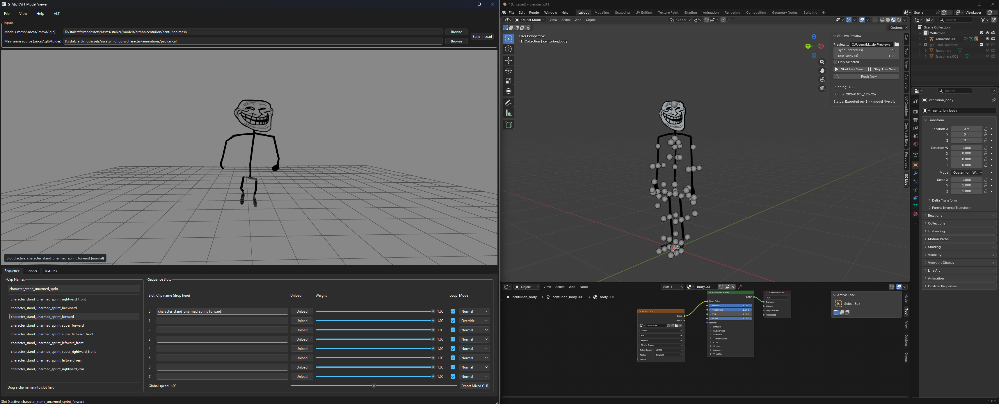

# SC Anim Preview Tool

Desktop-инструмент для превью моделей STALCRAFT и экспорта анимаций.

## Запуск
1. Установи Python 3.11+.
2. Установи зависимости: `pip install -r requirements.txt`.
3. Запусти `start.bat`.
4. В приложении нажми `Build + Load`.

## Blender Link (опционально)
1. Собери бандл через `Build + Load`.
2. В верхнем меню `ALT` включи `Enable BlenderLink`.
3. Установи add-on `blender_live_preview_addon.py` в Blender.
4. В `View3D -> Sidebar -> SC Live` укажи `Preview Root` на корень проекта и нажми `Start Live Sync`.

